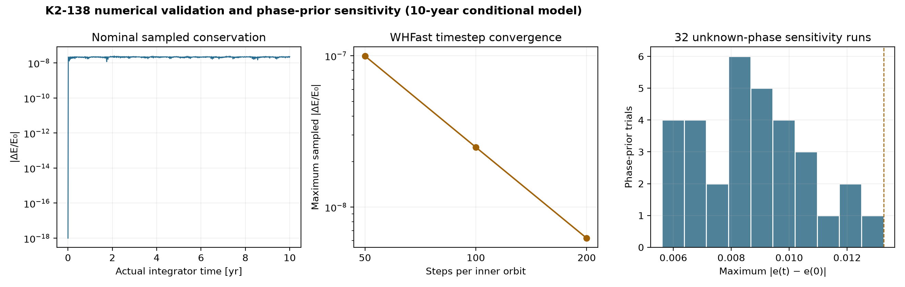

# EXODYNAMICS — Multi-Planet Systems in Motion

**Reconstructing, simulating, and observing real exoplanetary systems from public astronomical data.**

EXODYNAMICS is an open computational astrophysics platform that begins with a population survey, identifies genuine multi-planet systems, ranks their reconstruction evidence, and evolves archive-selected architectures with REBOUND. Observed, processed, simulated and model-predicted quantities are never conflated.

## Archive snapshot

<!-- BEGIN GENERATED STATS -->
| Quantity | Generated value |
|---|---:|
| Genuine source rows surveyed | **98,192** |
| Confirmed planets | **6,354** |
| Host systems | **4,764** |
| Multi-planet systems | **1,058** |
| High-multiplicity systems (≥6) | **14** |
| Tier A systems | **271** |
| Tier B systems | **760** |
| Near-commensurate adjacent pairs | **261** |
<!-- END GENERATED STATS -->

These values were generated from the timestamped response in [`results/archive_summary.json`](results/archive_summary.json), not typed from memory. The `ps` contribution includes multiple literature solutions; confirmed-planet counts use only `default_flag = 1`.

## Scientific flow

```text
NASA TAP snapshots → schema validation → exact host identity → evidence tiers
                   → uncertainty-aware parameters → REBOUND trajectory
                   → transit / TTV / RV forward models → observation residuals
```

The current release completes the live population foundation and a validated conditional K2-138 reconstruction. K2-138 is the deterministic first entry after ordering by reconstruction tier, parameter coverage, multiplicity and finally hostname; it is not uniquely preferred on scientific value. The nominal WHFast integration spans 10 years, uses `P_min/100`, and keeps the **maximum sampled** drift to `|ΔE/E₀| = 2.49×10⁻⁸` and `|ΔL/L₀| = 1.33×10⁻¹⁴`. A 50/100/200-step convergence test shows the expected reduction in energy error, while 32 disclosed phase-prior trials all pass the numerical tolerance. None of these results establishes long-term physical stability.



The phase ensemble draws independent uniform mean anomalies because archive phases are unavailable. It is a sensitivity experiment, not a posterior: the largest 10-year eccentricity excursion in these 32 trials is 0.0133, and the result cannot be extrapolated to gigayear stability or used as a resonance claim. Machine-readable products are in `results/timestep_convergence.csv`, `results/phase_prior_sensitivity.csv`, and `results/sensitivity_summary.json`.

## Repository map

- `src/exodynamics/`: archive client, population catalogue, dynamics, uncertainty and observation models
- `data/manifests/`: timestamped ADQL acquisition provenance and checksums
- `results/`: derived Parquet/CSV/JSON data, figures and simulation metrics
- `web/`: React/Three.js archive atlas and orbital laboratory
- `docs/`: research provenance, methods, assumptions, limitations and validation
- `paper/`: research manuscript source
- `notebooks/`: thin workflows backed by package functions
- `tests/`: numerical and data-model regressions

## Reproduce

```bash
make setup
make data
make survey
make simulate
make figures
make web
make test
```

Equivalent commands are available through `exodynamics data|survey|analyse`. Python 3.12+ and Node 22.12+ are required. The exact acquisition query, row count, timestamp, DOI and checksum are stored in every manifest.

## Scientific boundaries

- A near period ratio is not called a confirmed resonance without libration evidence.
- Missing nodes use a disclosed zero-valued project prior. The nominal trajectory also uses zero mean anomalies; a separate 32-trial uniform-phase sensitivity experiment exposes dependence on that choice.
- Planet sizes are visually exaggerated; orbital coordinates use one linear distance scale.
- No MAST light curve, DACE RV series, or new Gaia match is claimed in v0.1.
- Transit/TTV/RV modules are presently validated on controlled inputs, not presented as telescope analyses.
- Tier scores measure evidence coverage, not the probability that a model is correct.

See [`docs/LIMITATIONS.md`](docs/LIMITATIONS.md) for the complete boundary and [`docs/REPRODUCIBILITY.md`](docs/REPRODUCIBILITY.md) for snapshot policy.

## Citation and licence

Please cite using [`CITATION.cff`](CITATION.cff). Code is released under the MIT License. Archive data retain their source terms and should cite the NASA Exoplanet Archive dataset DOI `10.26133/NEA12`.
